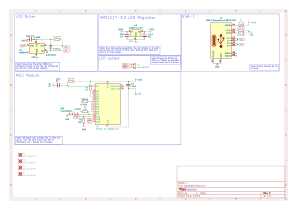
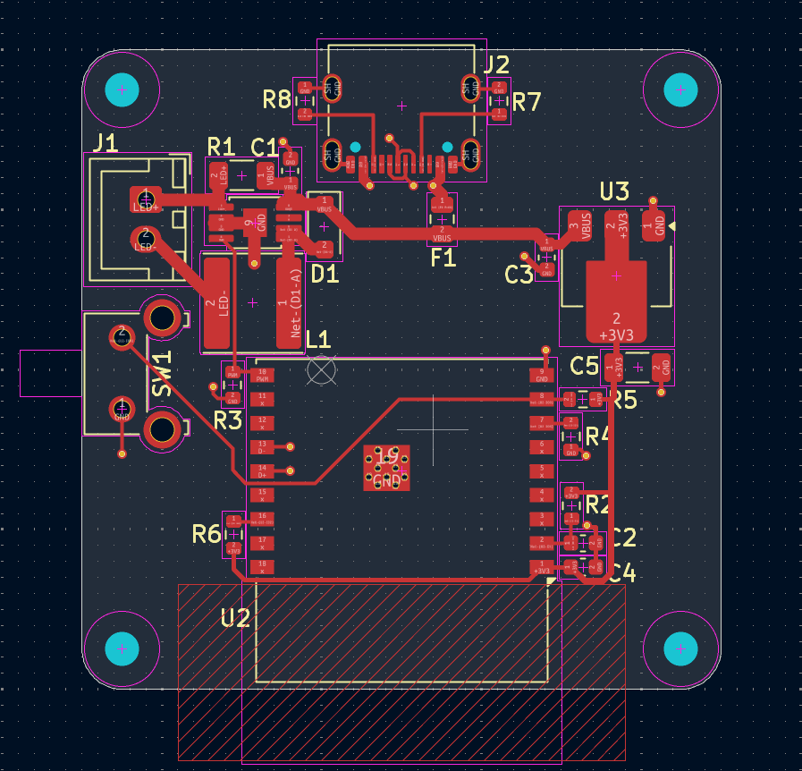

# The Spotlight Hardware

Spotlight is my first attempt at SMD soldering, PCB design, Circuitry implementing an IC, and many other smaller things, so bear with any mistakes I make and feel free to contribute if you have hardware knowledge! \
(Make sure you teach me something if you submit a PR >:] )

## The Schematic and PCB
##### Fraud at a glance?

### The ICs
- AL8841MP-13 \
  A buck converter stepping down the 5V input to ~714mA constant current configured by the 0.14Ohm sense resistor. The LED I am using is 5W and expects 3.6V at 1.2A but in my testing it was plenty bright at 700mA@3.3V so I decided that it will live its life at 3W (heatsinks really drove up the price per unit).
- AMS1117-3.3 \
  LDO regulator that provides 3.3V to the MCU.
- ESP32-C3-WROOM-02-N4 \
  Before its a hardware project this was initially an embedded project so I could learn RTOS, MQTT, and the ESP-IDF development framework! I went with the WROOM because I only planned on using one GPIO pin. The C3 MINI was a bit cheaper but had a lot of much smaller pads that I wasn't confident I could reflow. (Probably could've added some extra pins but I didn't wanna overcomplicate any more.)

### The Cool Image on the Back?!
The picture is an item icon in DEADLOCK (I <3 Deadlock) called [Boundless Spirit](https://deadlock.wiki/Boundless_Spirit). It has nothing to do with the project, just a cool stamp I snatched. I put it through some image dithering so that it can work with the silkscreen, when I get the first PCBs in I will put a picture of it to show the real world result.

# Assembling the device
I don't know yet, but I have a plan that I will share with anyone who is new so assembly can be easy and cheap, I am pinching as many pennies as possible with this project. (Possibly will make a video?)

### Parts List

As of now, to get flashbanged, all you need is:
- The materials in the BOM (in the ./production folder but I would export it yourself)
- 3.3V LED that wont die taking 750mA (technically the size doesn't matter yet since I don't have an enclosure made.)
- JST XH-2 connector with a cable
- a Heatsink for the LED, I am going to use a 40x40x11mm heatsink. 
I am going to put my bead LED on a little star aluminum PCB to make my life easier and to make heat transfer to the heatsink better.
